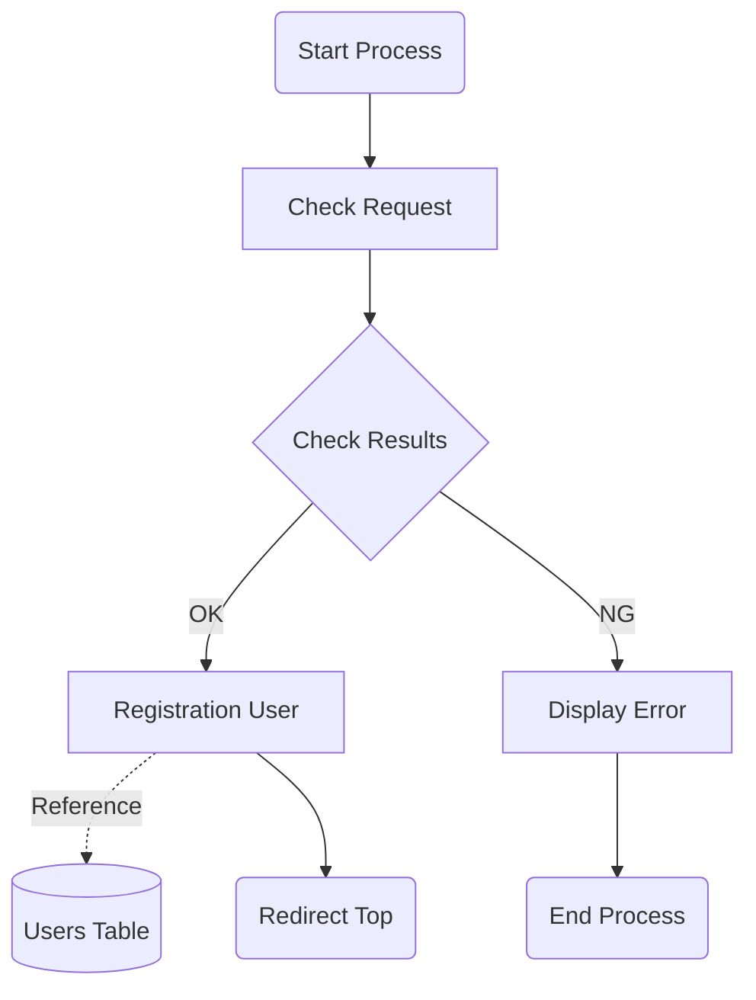

```
I trying mermaid addon for create the flowchart.
I am troubled for managing the documents.
Even if created, may not be easily updated.
I'm trying to make the creation and updating process easier.

# install the mermaid markdown syntax highlighting
https://marketplace.visualstudio.com/items?itemName=bpruitt-goddard.mermaid-markdown-syntax-highlighting

# can preview mermaid
https://marketplace.visualstudio.com/items?itemName=bierner.markdown-mermaid

```


